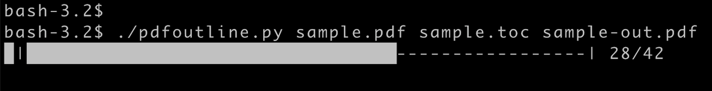

#  pdfoutline
### A command line tool for adding an outline (a bookmark, or table of contents) to pdf files


sample output:<br><br>


sample toc file:
```
# this is a comment
First Chapter 1
    first section 1
        first subsection 1
    second section 4
    third section 5

# a command to fix a gap between pdf pages and content pages
+10

Second Chapter 10
    some entry 10
    some entry 11
```

usage:
```
pdfoutline in.pdf in.toc out.pdf
```


