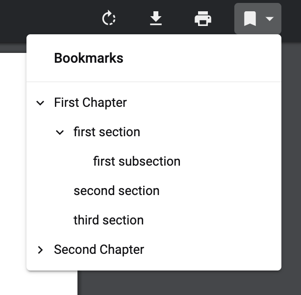

<!-- Vim: set foldlevel=1: -->
#  pdf-yaml-bookmark

## Overview



`pdf-yaml-bookmark` is a command-line tool that adds PDF bookmarks (outlines or table of contents) using an indentation-based format. It is written in Python, uses PyYAML for indentation parsing, and Ghostscript for the actual execution of Adobe `pdfmark` commands.

The bookmark data format can be as simple as the following:

```text:my_bookmark.bkm
# my_bookmark.bkm
# This is a comment

First Chapter 1
    first section 1
        first subsection 1
    second section 4
    third section 5

# An offset to fix a gap between PDF pages and content pages
+10

Second Chapter 10
    some entry 10
    some entry 11
```

## Why YAML?

`pdf-yaml-bookmark` uses YAML syntax as an intermediate representation for bookmark data, and it can also accept YAML directly. Here are a few reasons why we believe this is beneficial:

- **Robustness:** Rather than writing a custom parser for indentation, we first convert the `.bkm` format into YAML. Since YAML parsers are well-maintained and reliable, this reduces bugs and makes the tool more robust.  
- **Extensibility:** You can use YAML's more advanced features, such as anchors and references, to manage large or repetitive bookmark trees.

## Installation

### Prerequisites

Make sure you have `ghostscript` installed.

On macOS, you can use `homebrew`:

```bash
$ brew install ghostscript
$ gs --version
```

For Windows, download and install `ghostscript` from [the official website](https://www.ghostscript.com/releases/gsdnld.html).

### Installation

Install from PyPI:

```bash
$ pip install pdf-yaml-bookmark
```

## Usage

```bash
pdf-yaml-bookmark my_document.pdf \
    --bookmark my_bookmark.bkm \
    --output my_bookmarked_document.pdf
```

This command adds bookmarks contained in `my_bookmark.bkm` to the file `my_document.pdf` and outputs the result as `my_bookmarked_document.pdf`.

Use the `--show-progress` option to display a progress bar, which is especially useful for PDF files with many pages:

```bash
$ pdf-yaml-bookmark my_document.pdf \
    --bookmark my_bookmark.bkm \
    --output my_bookmarked_document.pdf \
    --show-progress
 |██████████████████████----------------------------| 118/263
```

You can specify the Ghostscript executable path using the `--gs-path` option:

```bash
$ pdf-yaml-bookmark my_document.pdf \
    --bookmark my_bookmark.bkm \
    --output my_bookmarked_document.pdf \
    --gs-path 'C:\Program Files\gs\gs9.55.0\bin\gswin64.exe'
```

Note: If the bookmark file has a `.yaml` or `.yml` extension, it will be parsed as YAML, structured by keys `heading`, `page`, `offset`, and `children`. In that case, it might look like this:

```yaml
# my_bookmark.yaml
# This is a comment
-
  heading: First Chapter
  page: 1
  offset: 0
  children:
    -
      heading: First section
      page: 1
      offset: 0
      children:
        -
          heading: Second section
          page: 1
          offset: 0
          children:
-
  heading: First Chapter
  page: 1
  offset: 5
  children:
    -
      heading: First section
      page: 1
      offset: 5
      children:
    -
      heading: Second section
      page: 1
      offset: 5
      children:
```

Run `pdf-yaml-bookmark --help` to see other available options.

## Contributing

Issues and pull requests are welcome. Please read [contributing.md](docs/contributing.md) before making a PR.

## License

This project is licensed under the [MIT License](LICENSE).
